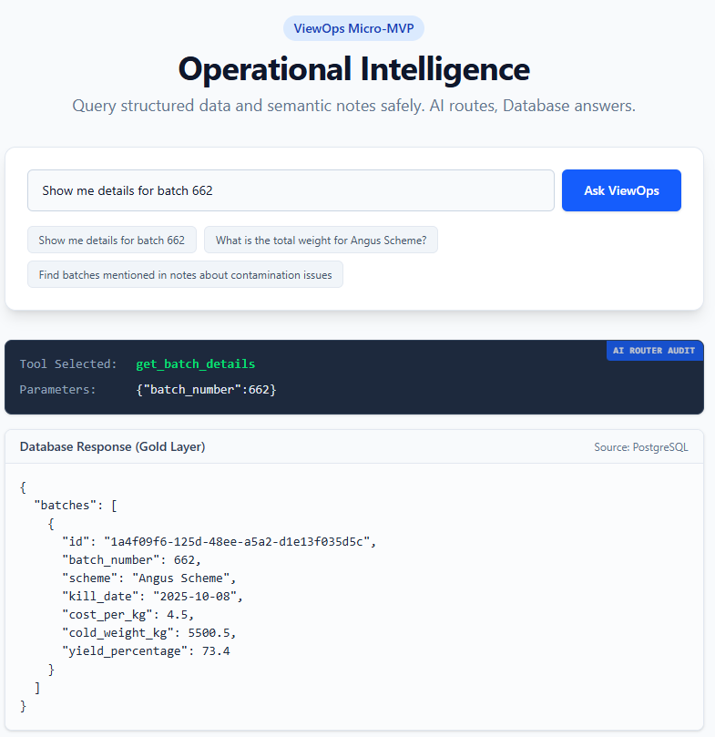
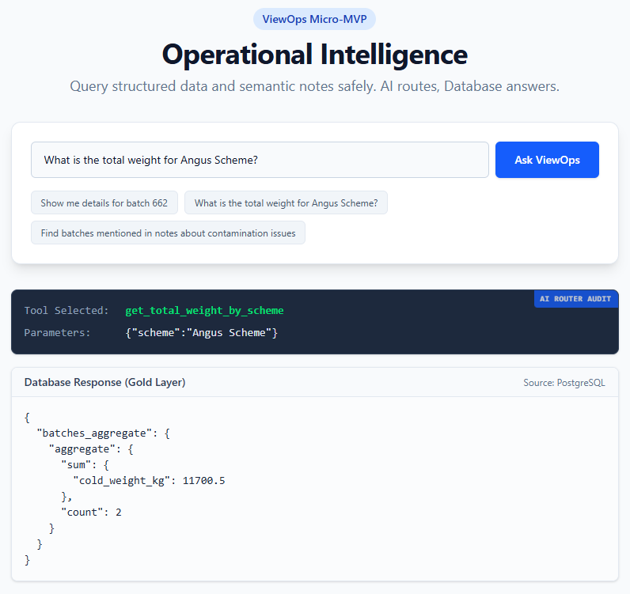
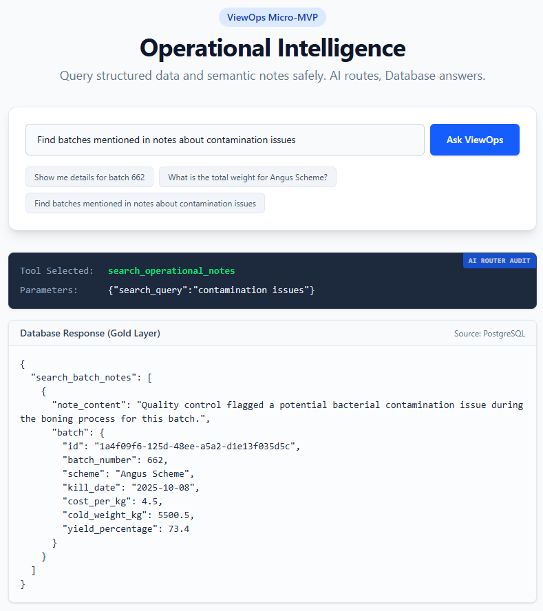
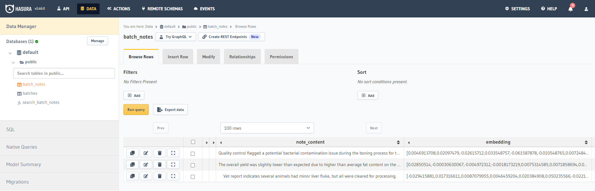

# AI-Powered Operational Data Query System

A production-ready demonstration of Retrieval-Augmented Generation (RAG) architecture using PostgreSQL's `pgvector` extension. This prototype showcases how to build an AI interface that connects operational data to large language models for safe, accurate, and context-aware querying.

## Core Architecture Principle

**The AI does not invent answers - it finds them.**

This system uses a hybrid approach that eliminates hallucination while providing natural language query capabilities:

### 1. Deterministic Routing (Structured Queries)

For known, structured questions with clear intent (e.g., "Show details for batch 662"), the AI acts as an intelligent router:
- Analyzes user intent using GPT-4o-mini
- Selects the appropriate predefined GraphQL query
- Extracts and passes only necessary parameters
- **Guarantees 100% accuracy** - the AI never generates or modifies data

### 2. Semantic Search (Unstructured Queries)

For vague or exploratory questions (e.g., "Find notes about contamination issues"), the AI acts as a research assistant:
- Generates vector embeddings of the user query
- Uses `pgvector` to find semantically similar content in operational notes
- Returns relevant structured data connected to unstructured findings
- **Provides contextually accurate results** without risk of hallucination

## Demo Use Case: Food Processing Operations

This implementation uses a food processing facility as the example domain, with sample data including:
- **Batch records**: Production batches with scheme codes, weights, timestamps
- **Operational notes**: Unstructured operator comments, QA observations, incident reports
- **Vector embeddings**: Semantic representations of notes for similarity search

## Visual Walkthrough

### Example 1: Deterministic Query - Batch Details

**User query:** "Show me details for batch 662"



**What happens:**
1. **Top section**: Natural language input from user
2. **Middle section (Audit Trail)**: OpenAI identifies the `get_batch_details` tool and extracts parameter `batch_number: 662`
3. **Bottom section**: Raw JSON response from GraphQL API using a predefined, vetted query

**Result:** 100% accurate data retrieval - the AI routing layer adds zero risk of data corruption or hallucination.

---

### Example 2: Deterministic Query - Aggregation

**User query:** "What's the total weight for scheme XYZ?"



**What happens:**
- AI selects the `get_total_weight_by_scheme` tool
- Database performs the calculation (not the AI)
- Returns trustworthy summary: total weight and batch count

**Result:** Complex analytical queries executed safely in the database with AI providing only the routing intelligence.

---

### Example 3: Semantic Search - Unstructured Data Discovery

**User query:** "Find any contamination issues"



**What happens:**
1. **AI Analysis**: Recognizes this as an unstructured query (no specific batch number)
2. **Vector Search**: Generates embedding of query → searches `batch_notes` using cosine similarity
3. **Result Linking**: Finds note mentioning "bacterial contamination" → automatically joins related batch data
4. **Output**: Returns both the relevant note AND the complete structured batch record (Batch 662)

**Demo Data Structure:**



**Result:** Vague human concern ("contamination") directly connected to actionable data record - bridging unstructured observations with structured operational data.

---

## Technical Stack

| Component    | Technology                          | Purpose                                    |
| ------------ | ----------------------------------- | ------------------------------------------ |
| **Frontend** | SvelteKit, TypeScript, Tailwind CSS | Responsive UI with real-time audit trail   |
| **Backend**  | Node.js                             | API orchestration and AI integration       |
| **AI Layer** | OpenAI GPT-4o-mini                  | Tool selection and embedding generation    |
| **Database** | PostgreSQL + `pgvector`             | Structured data + vector similarity search |
| **Data API** | Hasura GraphQL Engine               | Type-safe, permission-aware data access    |

## Getting Started

### Prerequisites

- Node.js (v18+)
- Docker & Docker Compose
- OpenAI API Key

### Step 1: Clone and Configure

```bash
git clone https://github.com/kasparpalgi/view-ops.git
cd view-ops
npm install
cp .env.example .env
```

Edit `.env` and add:
```env
OPENAI_API_KEY=your_openai_api_key_here
HASURA_ADMIN_SECRET=your_secure_password_here
```

### Step 2: Launch Database & GraphQL Engine

```bash
cd hasura
cp .env.example .env
```

Edit `hasura/.env`:
```env
POSTGRES_PASSWORD=your_db_password_here
HASURA_GRAPHQL_ADMIN_SECRET=your_secure_password_here  # Must match root .env
```

Start containers:
```bash
docker-compose up -d
```

Access Hasura Console (optional):
```bash
hasura console
```
This opens a GUI for managing tables, relationships, and testing GraphQL queries.

### Step 3: Initialize Database Schema

Apply migrations and seed data:
```bash
hasura migrate apply --all-databases
hasura metadata apply
hasura seed apply
```

This creates:
- `batches` table (structured production data)
- `batch_notes` table (unstructured operator notes + vector embeddings)
- `search_batch_notes` function (cosine similarity search)
- Sample batch and note records

### Step 4: Generate Vector Embeddings

Populate the vector database with sample operational notes:

```bash
npm run db:seed
```

This script:
1. Reads sample notes from configuration
2. Calls OpenAI API to generate embeddings (1536-dimension vectors)
3. Inserts notes + embeddings into `batch_notes` via Hasura GraphQL mutation

**Expected output:**
```
✓ Inserted note: "Batch completed ahead of schedule..."
✓ Inserted note: "Detected bacterial contamination..."
✓ Inserted note: "Equipment calibration check passed..."
```

### Step 5: Launch Application

```bash
npm run dev
```

Open your browser to **http://localhost:5173**

## Try These Sample Queries

### Structured Queries (Deterministic Routing)
- "Show me details for batch 662"
- "What's the total weight for scheme ABC123?"
- "List all batches from today"

### Unstructured Queries (Semantic Search)
- "Find any contamination issues"
- "Show me notes about equipment problems"
- "What batches had quality concerns?"

## Architecture Benefits

### For Production Operations
- **Zero hallucination risk**: AI never generates data, only routes queries
- **Audit trail**: Every query shows exact tool selection and parameters
- **Role-aware**: GraphQL layer can enforce permissions (not shown in demo)
- **Fast**: Vector search provides sub-second semantic results on millions of notes

### For Development Teams
- **Type-safe**: GraphQL + TypeScript eliminates runtime errors
- **Maintainable**: Predefined queries are versioned and testable
- **Extensible**: Add new tools by defining new GraphQL queries
- **Observable**: Built-in audit log for every AI decision

## Customization Guide

### Adapting to Your Domain

1. **Replace sample data** in `hasura/seeds/`:
   - Modify `batches` table structure for your entities
   - Adjust `batch_notes` to match your unstructured data

2. **Define your queries** in `src/lib/tools.ts`:
   - Create GraphQL queries for your common operations
   - Map them to AI tool definitions

3. **Customize embeddings**:
   - Adjust OpenAI embedding model in `scripts/seed-vectors.ts`
   - Fine-tune similarity thresholds in `search_batch_notes` function

4. **Update UI** in `src/routes/+page.svelte`:
   - Modify result rendering for your data structure
   - Add domain-specific formatting

## Key Files

```
view-ops/
├── src/
│   ├── lib/
│   │   └── tools.ts              # AI tool definitions + GraphQL queries
│   ├── routes/
│   │   └── +page.svelte          # Main UI component
│   └── app.d.ts
├── hasura/
│   ├── migrations/               # Database schema versions
│   ├── metadata/                 # Hasura configuration
│   ├── seeds/                    # Sample data
│   └── docker-compose.yml        # PostgreSQL + Hasura
├── scripts/
│   └── seed-vectors.ts           # Vector embedding generator
└── static/demo/                  # Screenshots for documentation
```

## Production Considerations

- **Rate limiting**: Add request throttling for OpenAI API calls
- **Caching**: Cache embeddings and common query results
- **Authentication**: Integrate Hasura JWT/webhook auth
- **Monitoring**: Add OpenTelemetry for observability
- **Scaling**: Use PgBouncer for connection pooling
- **Embeddings**: Consider batch processing for large note volumes

## License

MIT - Free to use and modify for any purpose.

## Questions?

This is a demonstration architecture. For production implementation guidance: kaspa@e-stonia.co.uk or https://wa.me/003725288846